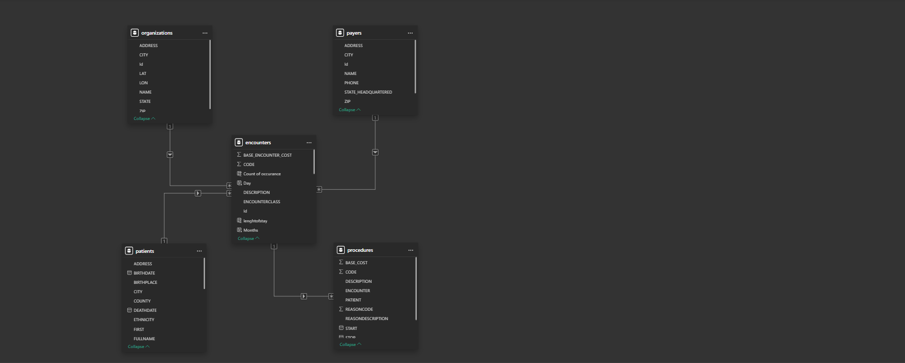
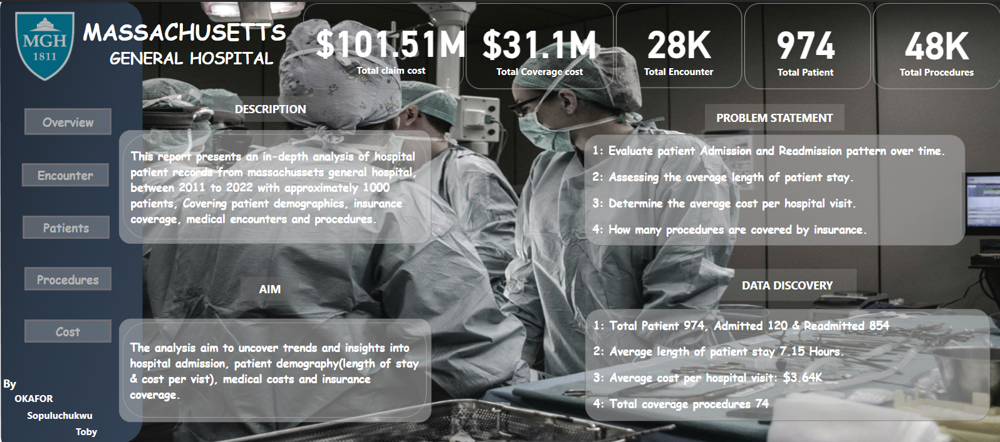
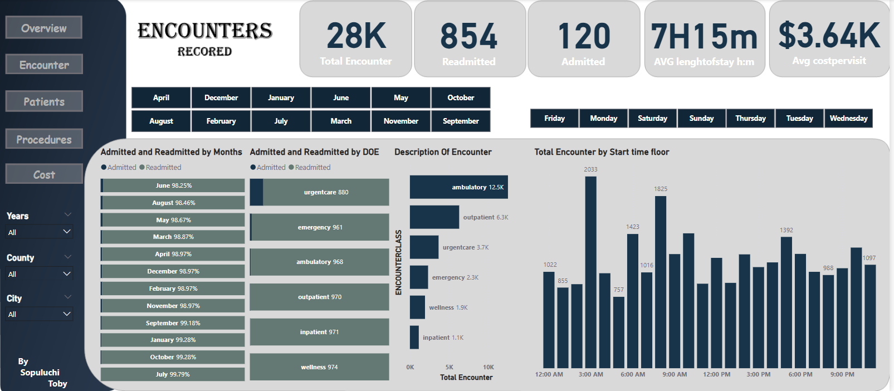
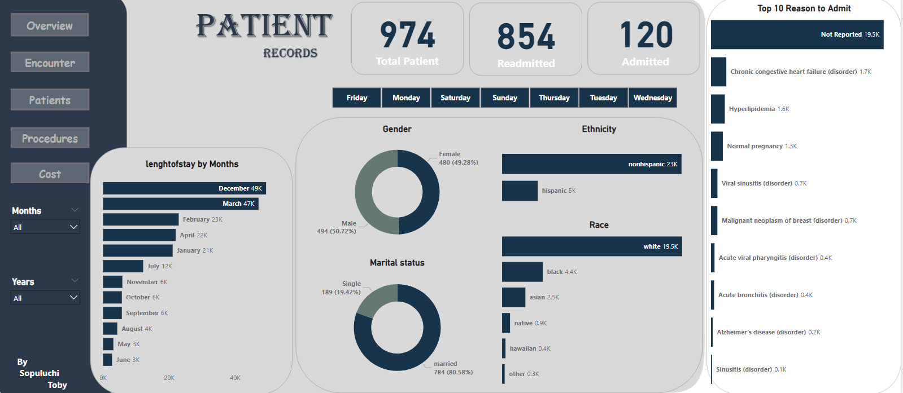
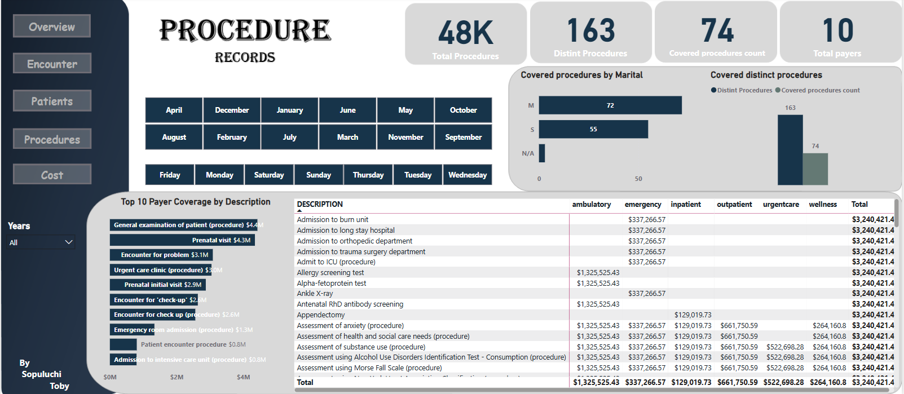
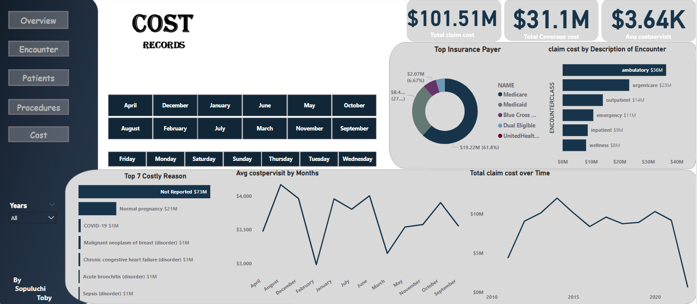

# Hospital-Patient-Records
Data from Massachussets General Hospital from 2011 - 2022.

## Data Source

Dataset from **_MAVEN ANALYTICS_**, imported into power BI for analysis containing multiple tables of data structure, **_75,592_** of records and **_55_** of fields.

## Introduction
This project analyzes Hospital Patient Records from Massachusetts General Hospital, containing synthetic data of approximately 1,000 patients from 2011 to 2022. The dataset includes information on patient demographics, insurance coverage, medical encounters, and procedures. The objective is to uncover insights into patient admissions, hospital stays, medical costs, and insurance coverage through data exploration and visualization.

## Problem Statement
1. How many patients have been admitted or readmitted over time?
2. How long are patients staying in the hospital, on average?
3. How much is the average cost per visit?
4. How many procedures are covered by insurance?

## Concept Execution
The following Power Bi features were incoperated;

- Data sources,
- Data cleaning,
- Power Query,
- Data modeling,
- Caculated Columns and Measures using Dax,
- Data Visualization,
- Filters,
- Dashboard Building and
- Reporting.

## Data Cleaning
The "Remove Duplicate" operation was used on the neccessary columns, confirming no duplicate existed, null and empty rows in REASONDESCRIPTION was replaced with "Not reported" and that of numerical columns replaced to 0. Column data types were appropriately validated such as formatting the cost columns to display currency.

## Modeling

The automatic derived table relationship were adjusted for proper connection and relationship between tables, by ensuring connections between primary keys and related foreign keys in another table.

## Data Discovery
1. **_How many patients have been admitted or readmitted over time?_** 

- *Total Patient* **974** `Count of occurance = COUNTROWS(FILTER(encounters,encounters[PATIENT] = EARLIER(encounters[PATIENT])))` to give us just exactly how many times individual patient visited the hospital. Then `Total Patient = COUNTROWS(patients)` to count the total number of individual patient.

- *Admitted* **120**    `Admitted = CALCULATE(
                COUNTROWS(
                    encounters),
                    encounters[Count of occurance] =1)` To filter how many patient visited only once.

- *Readmitted* **854** `Readmitted = [Total Patient] - [Admitted]`

2. **_How long are patients staying in the hospital, on average?_**

Difference of start of encounter and stop will result the length of stay `lenghtofstay = DATEDIFF(encounters[START], encounters[STOP],HOUR)` , however we wish to display the lenght in details of days, hours and minutes, 
i used  ``AVG lenghtofstay h:m = 
VAR AvgHours = 
AVERAGE(encounters[lenghtofstay])
VAR Hours = INT(AvgHours)
VAR Minutes = ROUND((AvgHours - Hours) *60,
0)
RETURN
    FORMAT(Hours, "0") & "H" &
FORMAT(Minutes, "00") & "m"`` .

i uesd the `Start time floor = FLOOR(
                    encounters[START TIME],
                     "1:00")` to get the approximate nearest hour of encounter.

3. **_How much is the average cost per visit?_**

*Average cost per vist* **$3.64k**  i used `Avg costpervisit = DIVIDE(
                        encounters[Total claim cost],
                        encounters[Total Encounter],
                        0)` Total claim cost which is the total cost of encounter / total encounter.

4. **_How many procedures are covered by insurance?_**

- Total procedures **48k** `Total Procedures = COUNT(procedures[DESCRIPTION])`,
- Distinct procedures **163** `Distint Procedures = DISTINCTCOUNT(procedures[DESCRIPTION])`,
- Covered procedures **74** ``Covered procedures count = CALCULATE(
                                COUNTROWS(
                                    VALUES(encounters[REASONDESCRIPTION])),
                                    encounters[REASONDESCRIPTION] <> BLANK())`` &
- Total payers **10** `Total payers = COUNT(payers[Id])`.

## Visualization

This report provides an in-depth analysis of hospital patient records from Massachusetts General Hospital between 2011 and 2022, covering approximately 1,000 patients. The analysis focuses on patient demographics, insurance coverage, medical encounters, and procedures.

The report comprises of 5 interactable page navigations for further exploration:
- Overview,
- Encounters,
- Patients,
- Procedures &
- Cost Analysis
Users can navigate through these sections to explore more insights and make data-driven decisions regarding patient care and hospital efficiency.

**Overview** : General features of the pages, featuring encounter, patient, procedures & cost.

**Encounter**:

- Total Encounters: 28K
- Admitted & Readmitted: 98.25% to 99.28% per month.
- Top Encounter Types: Ambulatory (12.5K), Emergency (2.3K), Urgent Care (3.7K)
- Peak Encounter Times: 6 AM and 9 PM.

**Patient Records**:

- Total Patients: 974
- Readmitted Patients: 854
- Admitted Patients: 120
- Gender Distribution: 49.28% female, 50.72% male
- Marital Status: 80.58% married, 19.42% single
- Ethnicity & Race: Majority are non-Hispanic (23K) and white (19.5K)
- Length of Stay (LOS) & Reasons for Admission:
- Highest LOS in December (49K) and March (47K).
- Major reasons for admission: Chronic congestive heart failure, Hyperlipidemia, and Normal pregnancy (but 19.5K were not reported)

**Procedure Records**:

- Total Procedures: 48K
- Distinct Procedures: 163
- Top Procedures: General examination ($4.4M), Prenatal visits ($4.3M), Urgent care clinic ($3M)
- Procedure Distribution: Ambulatory, emergency, inpatient, outpatient, and wellness services

**Cost Analysis**:

- Total Claim Cost: $101.51M
- Total Coverage Cost: $31.1M
- Average Cost per Visit: $3.64K
- Top Insurance Payer: Medicare (61.8%)
- Most Expensive Reasons: Normal pregnancy ($21M), COVID-19 ($1M), and Malignant neoplasm of breast ($1M).

**INSIGHTS**

Admissions & Readmissions

Total Patients: 974
Admissions: 120
Readmissions: 854

→ Insight: The high readmission rate (~87.7%) suggests potential concerns about patient recovery, follow-up care, or hospital policies regarding re-admission.

Patient Stay Duration
Average Length of Stay: 7.15 hours

→ Insight: Comparing with the rate of readmission, hospital stay indicates that most cases might be outpatient treatments or quick interventions.

 Cost Analysis
Average Cost per Hospital Visit: $3.64K

→ Insight: This cost analysis is crucial for understanding hospital expenses and patient affordability. Comparing it with insurance coverage rates provide further need for insurance 

 Insurance Coverage for Procedures
 Covered Procedures: 74

→ Insight: Total distinct procedures 163 and total covered procedures 74 which proves more than half of the total procedures are covered  dependently patients.

**Recommendations**

1. Improve Data Reporting:
High missing data (19.5K unreported reasons for admission, $73M in unspecified costs). Improve documentation for better  tracking.

2: The analysis reveals that a total of 854 patients were readmitted, highlighting a critical area for improvement in patient care and operations.Hence Healthcare professionals should establish a follow-up system to check in with patients soon after discharge, addressing any concerns or complications and providing clear guidance on medication, follow-up appointments, and self-care practices.

3: Enhance Ambulatory & Outpatient Services:
Ambulatory encounters are the highest (12.5K), showing demand for non-emergency services. Expanding ambulatory care can improve patient outcomes and reduce emergency admissions.

## Interactable project link
https://app.powerbi.com/links/-oxdDJyQDj?ctid=e84dc8d9-db2d-4316-aa74-3cf53c1fe0cd&pbi_source=linkShare&bookmarkGuid=4f53e969-997a-44e2-a3e0-de665002215a
